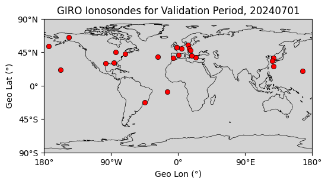
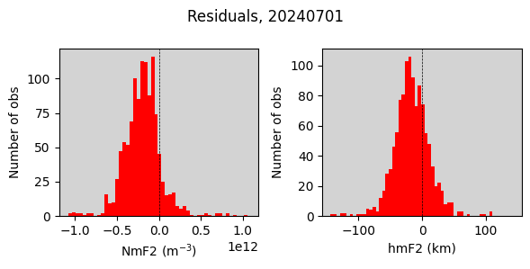
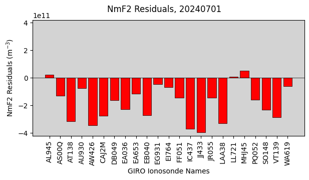
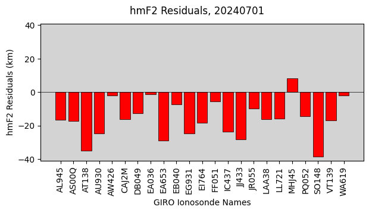

# PyVALION (Python VALidation for IONosphere)
[](https://pypi.org/project/PyVALION/)
[](https://github.com/victoriyaforsythe/PyVALION/actions/workflows/main.yml)
[](https://pyvalion.readthedocs.io/en/latest/?badge=latest)
[](https://doi.org/10.5281/zenodo.8235173)

PyVALION is a Python-based software package for validating ionospheric electron density model outputs.

For a given day, it downloads ionospheric parameters (such as NmF2, hmF2, B0, and B1) from the Global Ionosphere Radio Observatory (GIRO) and constructs a forward operator (geometry matrix) to compute the model-expected observations. It then calculates residuals between the observed ionospheric parameters and the model predictions and provides visual diagnostics.

A key advantage of PyVALION is its efficiency: if you need to validate multiple model runs on the same grid, the geometry matrix only needs to be computed once. This significantly speeds up and simplifies the validation process.

If you're validating your model across multiple days, you can run PyVALION in a loop and concatenate the residuals into 1-D arrays for broader analysis.


# Installation

PyVALION can be installed from PyPI, which will handle all dependencies:

```
pip install PyVALION
```

Alternatively, you can clone and install it from GitHub:

```
git clone https://github.com/victoriyaforsythe/PyVALION.git
cd PyVALION
python -m build .
pip install .
```

See the documentation for details about the required dependencies.

# Example Workflow

1. Create the model output dictionary
Record your model output into a dictionary called model with the following keys: 'NmF2', 'hmF2', 'B0', and 'B1', shaped as [N_time, N_lat, N_lon].

N_time: number of time steps (e.g., 96 for 15-minute resolution)

N_lat: number of geographic latitudes

N_lon: number of geographic longitudes

All arrays must have the same shape. Otherwise, the forward operator G cannot be applied consistently.

2. Define the units dictionary

```
units = {'NmF2': 'm$^{-3}$', 'hmF2': 'km', 'B0': 'km', 'B1': ' '}
Ensure your model output is in these units.
```

3. Create the atime array
This array should have N_time elements and must be a list of datetime objects that match the time dimension of your model dictionary. Example for 15-minute resolution:

```
dtime = datetime.datetime(year, month, day)
atime = pd.to_datetime(np.arange(dtime,
                                 dtime + datetime.timedelta(days=1),
                                 datetime.timedelta(minutes=15)))
```

4. Define the latitude array alat
This array must have N_lat elements and match the second dimension in the model dictionary.

5. Define the longitude array alon
This array must have N_lon elements and match the third dimension in the model dictionary.

6. Load the list of GIRO ionosondes

```
file_ion_name = os.path.join(PyVALION.giro_names_dir, 'GIRO_Ionosondes.p')
giro_name = pickle.load(open(file_ion_name, 'rb'))
```

If you wish to exclude ionosondes used in your data assimilation, simply modify the giro_name['name'] array.

7. Download GIRO parameters

```
raw_data = PyVALION.library.download_GIRO_parameters(atime[0],
                                                     atime[-1],
                                                     giro_name['name'],
                                                     data_save_dir,
                                                     save_res_dir,
                                                     name_run,
                                                     clean_directory=True,
                                                     filter_CS=90)
```

data_save_dir: path to save downloaded data

save_res_dir: path to save processed results

name_run: your chosen name for this run

8. Create the forward operator
```
obs_data, obs_units, G, obs_info = PyVALION.library.find_G_and_y(atime,
                                                                 alon,
                                                                 alat,
                                                                 raw_data,
                                                                 save_res_dir,
                                                                 name_run,
                                                                 True)
```

9. Compute residuals

```
model_data, residuals, model_units, res_ion = PyVALION.library.find_residuals(
    model, G, obs_data, obs_info, units)
```

10. Plot results
```
# Map of ionosonde locations
PyVALION.plotting.plot_ionosondes(obs_info,
                                  dtime,
                                  save_res_dir,
                                  plot_name='Ionosondes_Map.pdf')
```


# Histogram of residuals
```
PyVALION.plotting.plot_histogram(residuals,
                                 model_units,
                                 dtime,
                                 save_res_dir,
                                 plot_name='Residuals.pdf')
```



# Mean residuals for each ionosonde
```
PyVALION.plotting.plot_individual_mean_residuals(res_ion,
                                                 obs_info,
                                                 model_units,
                                                 dtime,
                                                 save_res_dir,
                                                 plot_name='IonRes.pdf')
```





# Learn More

See the [tutorials](https://github.com/victoriyaforsythe/PyVALION/tree/main/docs/tutorials) folder for an example that validates NmF2 and hmF2 from [PyIRI](https://github.com/victoriyaforsythe/PyIRI).
